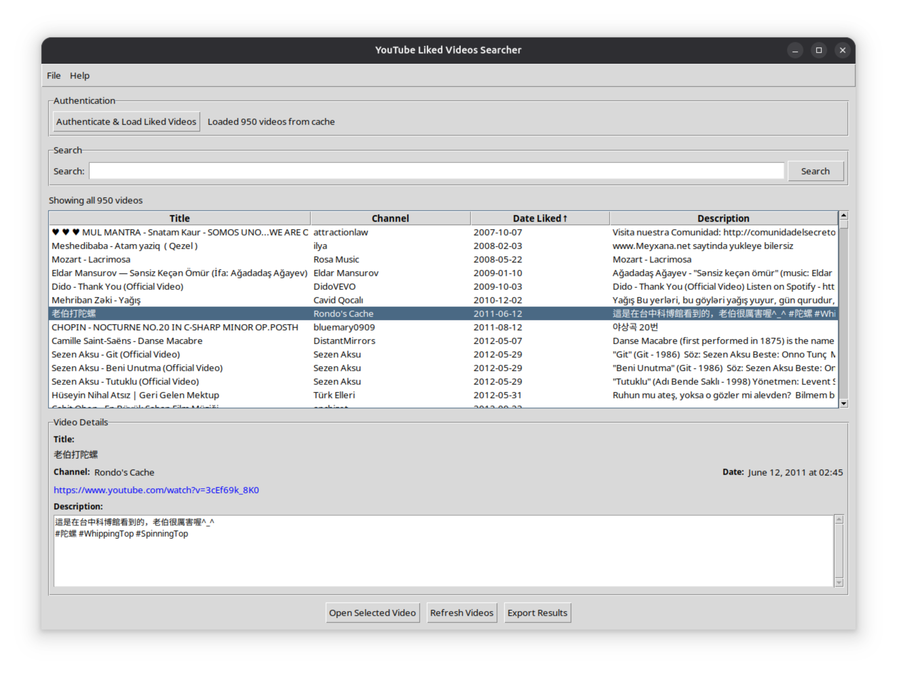
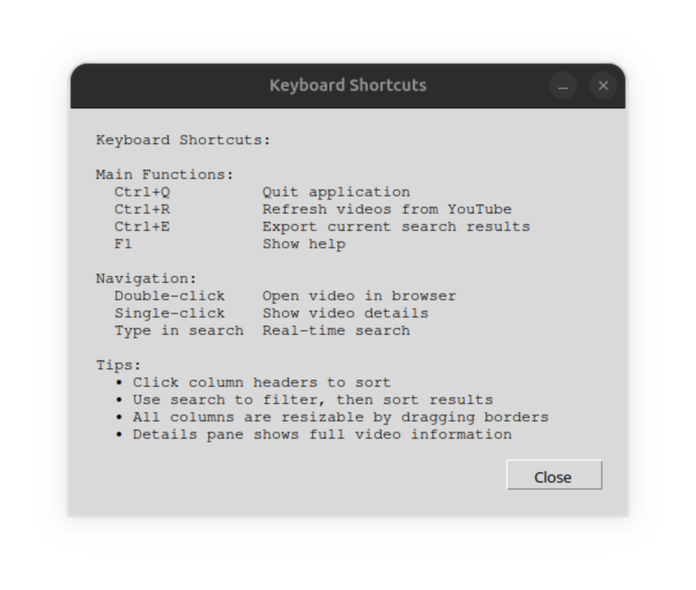

# YouTube Liked Videos Searcher

[](https://python.org)
[](LICENSE)
[](https://github.com/your-username/youtube-liked-searcher/releases)

A desktop application to search and browse your YouTube liked videos with advanced filtering and sorting capabilities.

## ⚠️ Disclaimer

The application and this repository have been created using AI tool, Claude. Human review and some modifications were done, however caution to be takne before further use.



## ✨ Features

- 🔍 **Real-time search** through video titles, channels, and descriptions
- 📊 **Sort by any column** with visual indicators (↑↓)
- 📝 **Detailed video information** pane with full descriptions
- 💾 **Local caching** for offline browsing
- 📤 **Export functionality** to JSON format
- 🎯 **Keyboard shortcuts** for power users
- 🔒 **Privacy-focused** - all data stays on your computer

## 🚀 Quick Start

### Option 1: Easy Setup (Recommended)
*Use the shared OAuth app - no Google Cloud setup required*

1. **Download the latest release** from [Releases](https://github.com/your-username/youtube-liked-searcher/releases)
2. **Extract the ZIP file** to a folder
3. **Install dependencies:**
   ```bash
   pip install -r requirements.txt
   ```
4. **Run the application:**
   ```bash
   python src/youtube_searcher.py
   ```
5. **Click "Authenticate & Load Liked Videos"** and sign in with Google
6. **Start searching!** 🎉

### Option 2: Advanced Setup
*Create your own Google OAuth app*

1. **Clone this repository:**
   ```bash
   git clone https://github.com/your-username/youtube-liked-searcher.git
   cd youtube-liked-searcher
   ```
2. **Follow the [Google Cloud Setup Guide](docs/google-cloud-setup.md)**
3. **Place your `client_secret.json` in the project root**
4. **Install and run as above**

## 📋 Requirements

- Python 3.7 or higher
- Google account with YouTube
- Internet connection for initial video loading

## 📖 Documentation

- 📘 [Setup Guide](docs/setup-guide.md) - Detailed installation instructions
- 🔧 [Google Cloud Setup](docs/google-cloud-setup.md) - Create your own OAuth app
- 🚨 [Troubleshooting](docs/troubleshooting.md) - Common issues and solutions

## 🖼️ Screenshots
 
 

## 🎯 How It Works

1. **Authenticate** with your Google account (OAuth 2.0)
2. **Load** all your YouTube liked videos via YouTube Data API v3
3. **Cache** videos locally for fast searching
4. **Search & Sort** through your collection offline
5. **Export** results for backup or sharing

## 🔒 Privacy & Security

- ✅ **Your data stays local** - nothing sent to external servers
- ✅ **Read-only access** to your YouTube liked videos only
- ✅ **Standard OAuth 2.0** authentication flow
- ✅ **No tracking or analytics** - completely private
- ✅ **Open source** - verify the code yourself

## 🤝 Contributing

Contributions are welcome! Please see [CONTRIBUTING.md](CONTRIBUTING.md) for guidelines.

1. Fork the repository
2. Create a feature branch (`git checkout -b feature/amazing-feature`)
3. Commit your changes (`git commit -m 'Add amazing feature'`)
4. Push to the branch (`git push origin feature/amazing-feature`)
5. Open a Pull Request

## 📄 License

This project is licensed under the MIT License - see the [LICENSE](LICENSE) file for details.

## ⚠️ Disclaimer

This application uses the YouTube Data API v3. Users are responsible for complying with Google's Terms of Service and API usage policies. This app is not affiliated with Google or YouTube.

## 💬 Support

- 🐛 **Bug reports:** [GitHub Issues](https://github.com/your-username/youtube-liked-searcher/issues)
- 💡 **Feature requests:** [GitHub Issues](https://github.com/your-username/youtube-liked-searcher/issues)
- 📧 **Email:** ellshad.012@gmail.com

## 🌟 Star History

If you find this project useful, please consider giving it a star! ⭐

---

**Made with ❤️ for YouTube power users**
```
